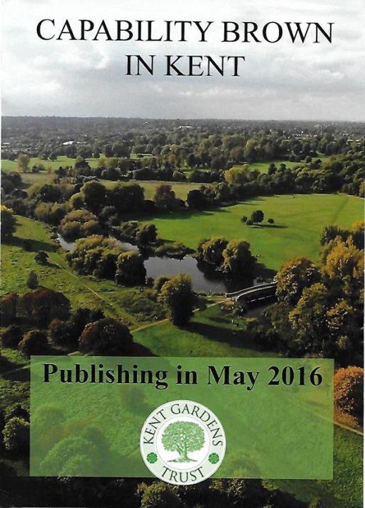

13 May 2016

To NCRA Members :

CAPABILITY BROWN AND NORTH CRAY

The Kent Gardens Trust is one of the organisations supporting the NCRA in our efforts against the proposed housing development on garden land lying between St James Way and The Grove.

Like us, they are concerned about the effect this is likely to have on the two Cedar trees that Capability Brown planted circa 1782, when that piece of land together with Footscray Meadows formed part of the parkland surrounding North Cray Place.

The Trust has just published a beautifully illustrated history of Capability Brown's work in Kent, and his influence on estates in Kent such as Chilham Castle. One chapter is devoted to North Cray Place and the book cover features the Five Arched Bridge and our Meadows. 

The price of the book is £9.50 and can be obtained through the Trust's website at [www.kentgardenstrust.org.uk](http://www.kentgardenstrust.org.uk)
