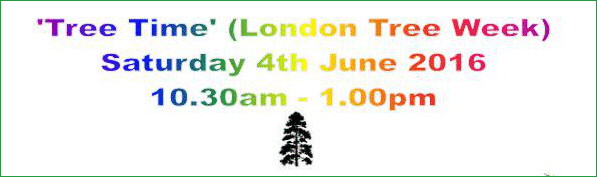

28 May 2016

To NCRA Members :

Two Dates For Your Diary

Friends of Foots Cray Meadows are organising two informative and fun events during June :

This year is the Tenth Anniversary of the Friends of Foots Cray Meadows. To celebrate this Ten Mature Trees have been planted between Rectory Lane and the Lime Avenue.

As part of the London Tree Week an event is being organised which is a great opportunity: to find out what species these

trees are and how we shall care for them; how to identify trees, to learn about woodland management on the Meadows and meet Bexley’s Tree Officers.

---

Please 'click' on the posters above for full information.
