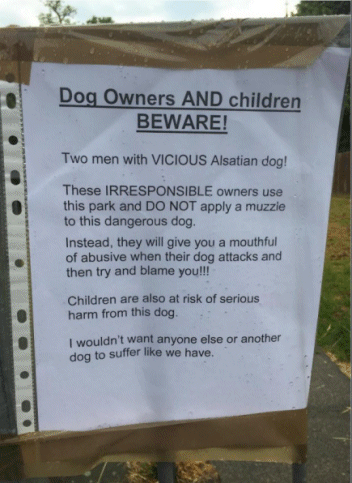

8 June 2016

To NCRA Members :

Dog Warning.

A member has brought the following notice to our attention :-

Select the image above for an enlarged view.

Our member goes on to say : 'When walking to work this morning I found the attached on the gate in The Grove leading to the Church. I saw this dog for the first time the other night at around 7.00pm at the beginning of High Beeches, walking around to the Local Authority Estate.

Their dog was on the opposite side of the road to mine, but he went 'nuts' when he saw our Cockapoo.... I agree with this notice as it really did look aggressive. Just thought you ought to know.'
