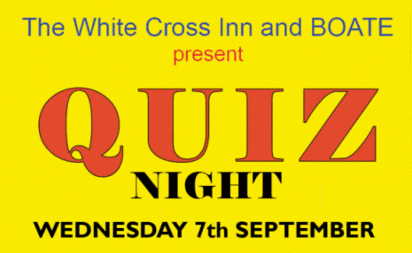

18 August 2016

To NCRA Members :

Upcoming BOATE Events

Following their summer break, BOATE are now planning their next round of fund raising events.

Plans in the pipeline include Fund Raising Quiz nights at the White Cross for September, October and hopefully December with a new play planned for November.

Click on the poster above for full details

BOATE's fund raising effort is to help with the construction and fit-out of a room for a young man with a terrible disease. The room will be an extension to his parent's house and will include a bedroom/living room and shower all of which can be accessed using a wheelchair.

Over time, BOATE are hoping to raise sufficient cash to pay for the special doors and maybe the lifting equipment.
