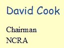

4 October 2016

John Harrington's 90th Birthday

I am sure you will all join us today, 4 October 2016, in wishing John Harrington, our President, a very happy 90th Birthday.

John has dedicated some 60 years of tireless commitment to the protection and wellbeing of the local community for the benefit of its residents. He has lived almost all of his life in North Cray and became involved in supporting local affairs in his late teens joining the North Cray Ratepayers Association (North Cray Residents Association) shortly after its formation in March 1944 and is, today, still an active member as its honoured President - having previously been Chairman for many years. Throughout this time John has played a leading part in the efforts that have defended, preserved and enhanced so much of what people value in North Cray, not least in steering the village through the challenging and difficult time when the old North Cray Road was changed into a dual carriageway and in efforts that led to the development of Foots Cray Meadows into one of the largest and much loved natural open spaces in the Borough.

John has also served the wider community through his service on Bexley's Conservation Advisory Committee, serving on this committee from soon after its creation in the early 1970's until its demise in 2012. He continues to serve Bexley in this way through his presence on the Bexley Civic Society's Planning, Conservation and Environment Committee; and he served as chairman of the Bexley Civic Society from 1995-1998. In these ways he has made a major contribution to the formation of North Cray's two Conservation Areas and in the task of protecting historical features throughout Bexley and its Green Belt and Heritage Land.

For many years John has also made a contribution to charitable work in a wider arena of public service through his membership of Tallow Chandlers (livery company).

Through the 1970's to early 1990's John served the local community more directly as councillor for Cray Ward (now Cray Meadows) and was elected as Mayor of Bexley for 1988/89.

In a more pastoral capacity John has been associated with St James Church North Cray throughout most of his life and, until fairly recently, had been Churchwarden since 1980 (approx.) playing a leading part in this aspect of North Cray village life. Additionally, for many years he was a school governor of two schools, Sidcup Hill and North Cray.

After a lifetime of devoted support to the local community John was presented with a 'Civic Recognition of Outstanding Achievement' award by Bexley Council in 2014 - an award thoroughly deserved. His exemplary sense of 'community' epitomises what makes a good citizen.

