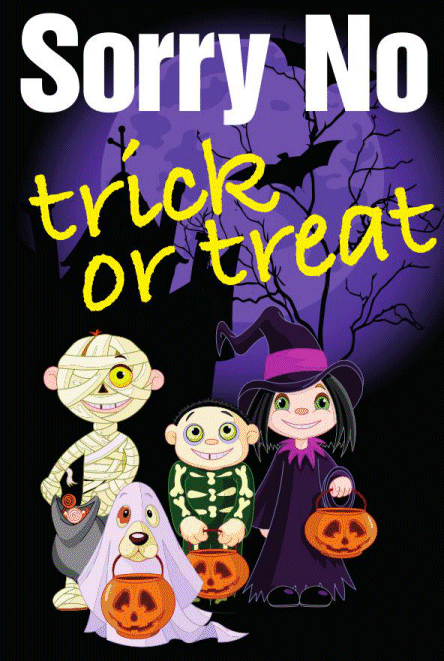

13 October 2016

Trick or Treat - Alternative Poster

Thanks to PC 427 Lorraine Pinkerton from Cray Meadows Ward Policing Team for sending the following alternative poster and message :

Click on the poster for an enlarged view

Not everybody likes the Halloween season and some may not wish to engage with these festivities. Therefore please find attached leaflet designed to deter “trick or treat” visitors to your address, it also contains some useful crime prevention advice. Please feel free to share this with your friends and neighbours.
