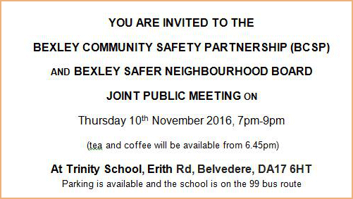

30 October 2016

(1) Staying Safe

Thanks to PCSO 7325 Pauline Cimen of Cray Meadows Neighbourhood Policing Team and Danielle Fuller from Bexley Safer Neighbourhood Board for the following invitation :

Click on the poster for full details.

(2) Coffee with Cops

Thanks to PCSO 7249 Julia Turner from Sidcup Neighbourhood Policing Team for the following invitation :

Sidcup Team will be in Costa Coffee, Station Road on 3/11/16 and 16/11/16 1100-1200 hours. Please come and join them if you wish any updates or Crime prevention advice. Or just come and say hello.

(3) The Rubbish Mountain

The Good News is that work to remove this from the former Waste4Fuel site in Cornwall Drive is planned to begin on Monday 31 October, and is expected to last for 20 weeks.

Follow this [link](http://www.bromley.gov.uk/waste4fuel) for more information.

The hope is that disruption to local traffic can be kept to a minimum; but the biggest threat is smoke as the centre of the heap is at a very high temperature.
