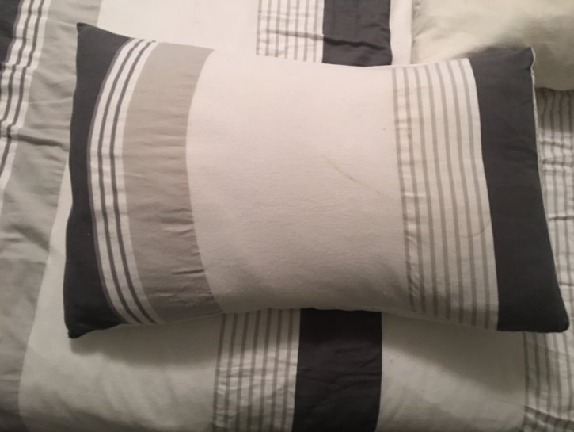

7 January 2017

Burglary Alert

Sadly our first NewsMail for 2017 is to report that one of our members in St James Way was recently burgled. Our member writes :

Today at around (Friday 6th January) 6.30pm our house was burgled. They gained entry by smashing the glass in the UPVC french doors on the rear of the property.

The property was completely ransacked from top to bottom with the mainly watches and jewellery stolen.

It has been reported to the police but I wanted to make everyone aware.

The photgraph below shows a pillowcase that was taken from the bed and probably used for carrying the jewellery away.

If anyone spots it, please report it to our local police team :

Email: craymeadows.snt@met.police.uk

Tel: 020 7230 4365

PS Luke Slight

PC Lorraine Pinkerton

PCSO Pauline Cimen
