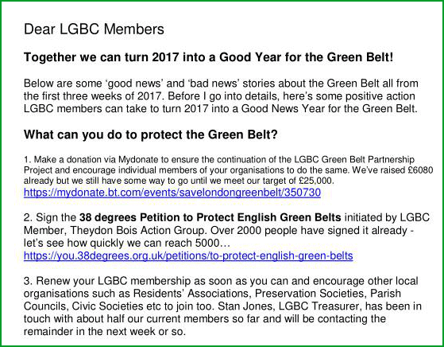

18 January 2017

HELP PROTECT THE GREEN BELT

Residents of North Cray have already taken an important step in helping to protect our precious Green Belt by joining our Association - which has this as a primary objective, and which is why the NCRA is an active member of the London Green Belt Council.

Below is a link to the latest update from the LGBC.

Click on the image for an enlarged view

You will see from this that one of the things you can do to support its efforts is to sign the petition initiated by LGBC member, Theydon Bois Action Group. Follow the link above.

Our Green Belt is under threat, not least from government pressure to "build, build, build". The NCRA will continue to do all that it can to preserve it and fight off moves to develop it. Once it is gone, it will be lost forever!
