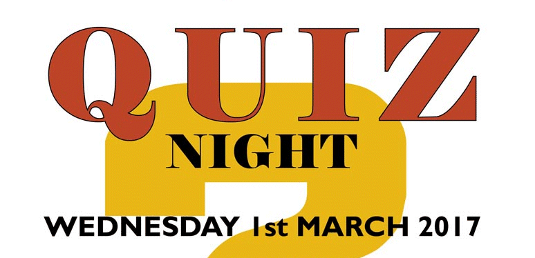

13 February 2017

(1) Quiz Night at the White Cross

BOATE's February Quiz night was a great success. Their next quiz will be held on 1st March.

Click on the poster for full details

(2) Illegal fishing

Thanks to Nick at the Grove who reported :

Sunday 12th February 1.10 pm. The anglers are back again, just 2 this time. They appear to come most Sundays now.

We passed this information on to our local Police Team who have advised that any member who sees illegal fishing should quickly phone the Environment Agency direct on 0800 80 70 60 - and also phone the Police on 101. Hopefully this will enable prompt action to be taken to apprehend the culprits. Please also let us know so that we can monitor and report back to members.
