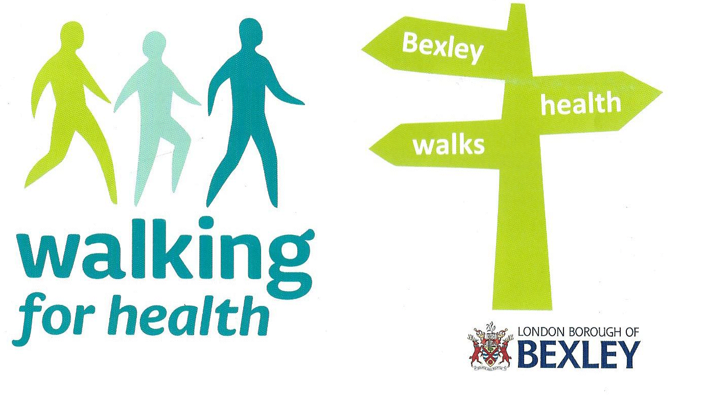

17 February 2017

Walking for Health

Now that the worst of winter is hopefully past, members who want to get out and about, enjoy some moderate exercise and meet new friends may be interested in Bexley's Walking for Health program.

Our nearest organised walk is along the river Shuttle, woodlands and pathways to Old Bexley Village with a midway stop at the library for refreshments.

It takes place every Tuesday and lasts a little over 1 hour.

Meet at 11am at the corner of Riverdale and Bridgen Road, Bexley.

Please see [MAP](https://www.google.co.uk/maps/place/Riverdale+Rd,+Bexley+DA5+1RD/@51.4453438,0.133882,17z/data=%214m5%213m4%211s0x47d8ae89383a690f:0x3e4ba25ad6bb1579%218m2%213d51.4452553%214d0.1355179?hl=en)
