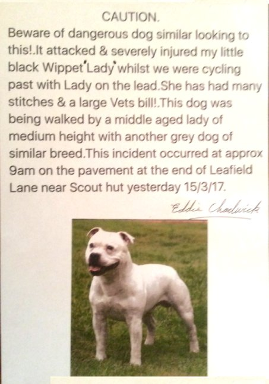

17 March 2017

Dog Attack..

NCRA received the following warning from one of our members today:

My little dog was attacked by another dog this week & was badly injured in the neck, had to be stitched up plus a huge vets bill.

Unfortunately my first thought was for the welfare of my dog as she ran up the North Cray Rd to get home.consequently I didn't get any details from the owner whose dog attacked.So she got away Scot Free.

Unfortunately this could happen again if she doesn't control her dog somehow.

I have Posted several warning Posters around the Foots Cray Meadows.

see below.

