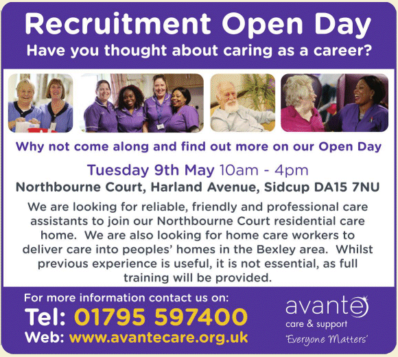

4 May 2017

(1) Date For Your Diary

The NCRA Annual General Meeting will be be held in St James Church 4 July at 8pm (drinks and nibbles from 7.30pm).

---

(2) Job Opportunities

Thanks to Sarah Bruton at Avante Care for alerting us to the following recruitment open day that may be of interest to any members looking for work :

Click on the poster for an enlarged view

---

(3) Closure of Parsonage Lane from 8 May

Just a reminder that Parsonage Lane will be closed for Thames Water investigative works between North Cray Riding School and No. 29 from next Monday, 8 May - and these are expected to last for up to a week.
