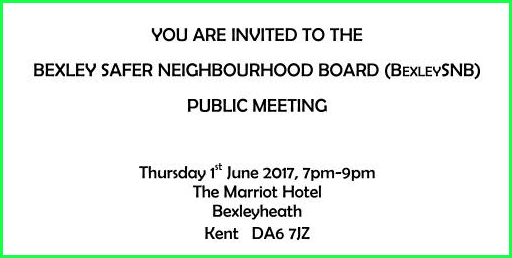

10 May 2017

Bexley SNB Public Meeting

Thanks to Danielle Fuller and Joyce Sutherland from Bexley Safer Neighbourhood Board for the following invitation :

The BexleySNB has pleasure in inviting you to their public meeting on Thursday 1st June, taking place at the Marriott Hotel, Bexleyheath from 7pm to 9pm.

Click on the poster for full details

Please feel free to pass the invitation on should you know of someone who would also be interested in attending.

---

Upcoming BOATE Events

Thanks to Steve Brown, BOATE's Marketing Manager for information on the last two events in BOATE's current programme :

It's nearly July already and time for us to take a break from quizzes, so it would be good to see you at our last Quiz Night on 7th June. Also, please don't forget our Bingo night on 15th May which should be a great evening.

If you've not been to BINGO before it is great fun. At £12.00 you will receive an eight page BINGO book that has potentially three games per page. Those three games can be the first person with a single line; two lines or a full house. Each of the games will pay cash prizes but the number of games and the size of the prizes depends on the number of players. For example if we have 60 players then the Jackpot prize for the last Full House (page 8) will be £45 and the single line prize for the first game will be £15.00. If we have 75 people then the Jackpot prize for the last Full House (page ) will be £60 and the single line prize for the first game will be £15 so you get your money back immediately.

I do hope you you fancy joining us for want should be a good evening and an opportunity for us to continue to raise funds for our 'Nicholas's Room' project.

Click on the posters for an enlarged view

---

News from Cray Meadows Neighbourhood Policing Team

Thanks to PCSO Pauline Cimen for the following update on crime in Cray Meadows Ward :

Burglary, Non Dwelling, Attempted break in wooden garage, Royal Road, 1-3/5/2017, 2359 hrs

Theft of Pedal Cycle, Ellenborough Road, 4/5/2017, 1930 hrs

Criminal Damage to Motor Vehicles, Edgington Way/industrial site, 2 wing mirrors smashed, 6/5/2017, 1500 hrs
