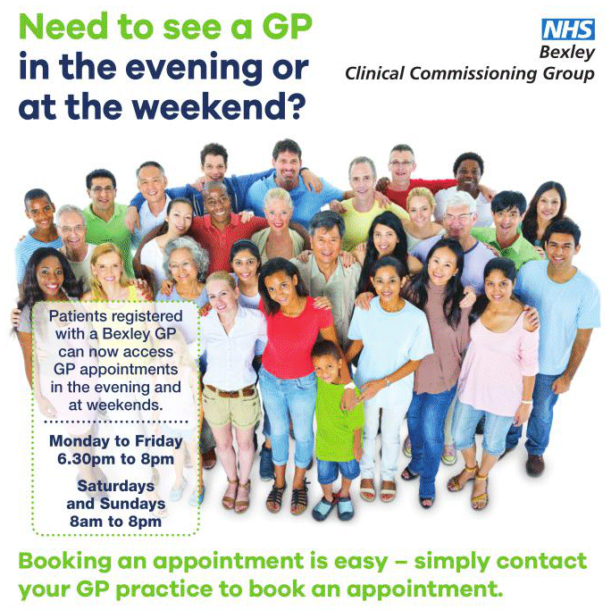

10 June 2017

(1) Evening and Weekend GP Access

Thanks to Bexley Health Neighbourhood Care for the following information poster :

Click on the poster for full details

---

(2) Dogs in the Meadows

A further comment on the subject of uncontrolled dogs from John Window of Mount Mascal Stables.

We long ago gave up using Stable Meadows due to dog owners seeming to take great delight in their dogs chasing horses and ponies in the Meadows. The majority of riders pay a nominal fee to the Woodland Trust and ride in Joydens Wood. Where dogs are supposed to be on the lead.
