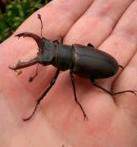

13 June 2017

(1) Freemasonry Open Day

Click on the poster for an enlarged view

---

(2) Stag Beetles

Thanks to Bexley Wildlife for sending us the following link to a Stag Beetle survey that we can assist with this summer.

If you have a Stag Beetle sighting to report

Click on the beetle to access the survey.
