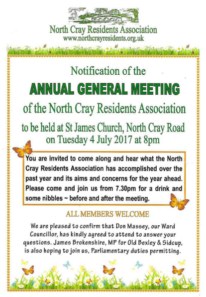

2 July 2017

(1) Cyber Crime Prevention Videos

Cyber Crime is becoming more and more frequent. As part of a cyber crime prevention campaign, the Metropolitan Police have produced some very useful advice including videos.

Please visit their website via this [LINK](http://news.met.police.uk/news/met-launches-cyber-crime-prevention-video-campaign-248059) for full details.

---

(2) NCRA AGM - Reminder

Click on the poster for an enlarged view

---

(3) Neighbourhood Watch Update

Thanks to PCSO Pauline Cimen for the following update :

25/6/2017 between 1830 and 2317 -Theft motor vehicle from Bexley Lane.

24/-25/06/2017 between 2330-0400 hrs - Theft from motor vehicle in Harvill Road.

Between 23 and 26/06/2017 at between 1700 and 0600 hrs - Criminal damage to a vehicle in Harvill Road - 3 windows smashed.

24/06/2017 between 1000 and 1200 hrs - Criminal Damage to a motor vehicle in Ellenborough Road - wing mirror damaged.

27/06/2017 between 0759-1400 hrs - Burglary of Dwelling in Sidcup Hill - Entry via front door and an untidy search with nothing taken.

27/06/2017 between 0120-0315 - Burglary of Dwelling in Durham Road - Motor bike taken from garage. A Watch /currency/bank cards/house and car keys also taken.

25/06/2017 - Burglary of Dwelling at Mount Mascal Stables, Dairy Cottage - Jewellery taken.

Cray ward has been hit quite a bit this week so please make sure you lock all doors and windows when out and about. Also check that doors and windows are locked securely before you go to bed. If anyone has any information please contact police. If you see anyone acting suspiciously please also contact police.
