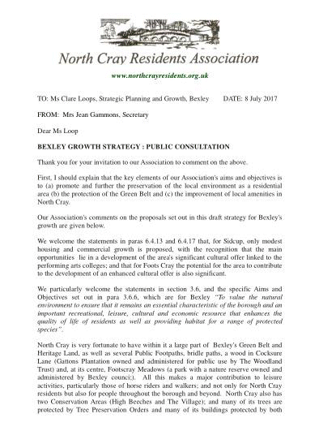

8 July 2017

BEXLEY'S GROWTH STRATEGY - NCRA's response

With the deadline for public consultation on Bexley's Growth Strategy fast approaching (14 July), the NCRA has submitted a letter to Bexley setting out the views of the committee.

Click on the above image of our letter to read as a pdf

The full details of Bexley's Growth Strategy and an opportunity to leave your comments can be accessed via the following link:[www.bexley.gov.uk/services/planning-and-building-control/planning-policy/growth-strategy](https://www.bexley.gov.uk/services/planning-and-building-control/planning-policy/growth-strategy)
