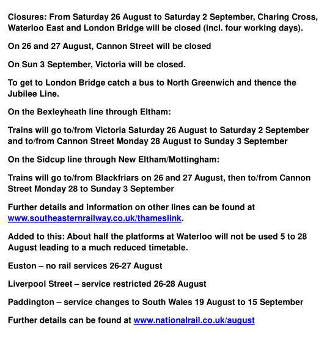

10 August 2017

(1) REVIEW OF POLLING DISTRICTS AND POLLING STATIONS

Bexley Council is consulting people on the next stage of the Boundary Review, which is to finalise Polling Stations and Polling Districts.

It is proposed that the existing Polling Stations would remain at SDA Riverway (Parsonage Lane) and the North Cray Neighbourhood Centre (NCNC).

Regarding Polling Districts, the present plan is to use the existing arrangements for the two Polling Districts included in our membership area, which are:-

CM3 This roughly covers North Cray Village and rural areas

CM5 The area around the Neighbourhood Centre (including Bedensfield Estate; High Beeches area and surrounding roads; and Maidstone Road).

However, it has been suggested to us that it would be better to transfer a certain area from CM5 to CM3, namely The Grove, The Spinney, High Beeches, St James Way and Holt Close - this better reflecting the community split and making it easier for a number of people to vote on foot. It would also even-up the numbers slightly for administrative purposes. However, our members will wish to make their own representation on their preference.

We hope that members will contribute their views to this Consultation.

Please use the following link to the[survey questionnaire](https://www.surveymonkey.co.uk/r/NWRYFF3).

The deadline for submissions is 9am on Monday 4 September 2017.

---

(2) Trains in August and September

Thanks to Laurie Baker from The Eltham Society for the following information :

Click on the poster for an enlarged view
