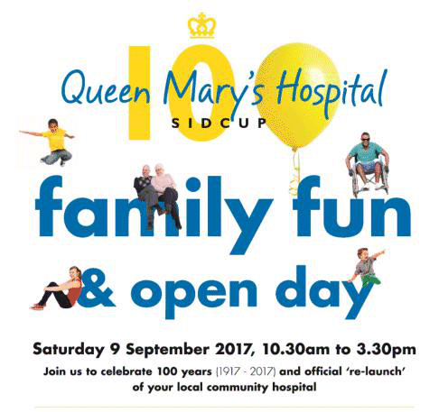

18 August 2017

Queen Marys Hospital community event

Thanks to Sidcup Community Group for sending us details of the following event at Queen Marys Hospital, organised by Bexley Voluntary Service Council.

Queen Marys Hospital is planning a free Family fun and Open Day to mark their centenary on the 9th September 2017 10.30-3.30.

Click on the poster for full details

Entertainment and activities include:

. A fete

. Entertainment and musicians

. Children's interactive area

. A time tunnel showing the history of the hospital

. Tours of the new cancer centre, kidney treatment centre, theaters and Acorn Children's centre and loads more.
