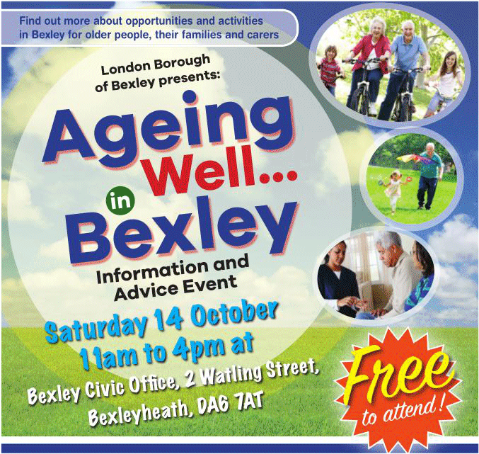

4 October 2017

(1) Ageing Well in Bexley

Thanks to John Coleman for sending us the following poster :

Click on the poster for an enlarged view and full details

---

(2) Planning outcome

| Location     | Application Details                                                                                                                      | Reference    | Outcome                                                                                                     |
| :----------- | :--------------------------------------------------------------------------------------------------------------------------------------- | :----------- | :---------------------------------------------------------------------------------------------------------- |
| 45 The Grove | Part one/part two storey front/side and rear extensions incorporating a basement and associated works to provide a five bedroom dwelling | 17/00396/FUL | Application Permitted with [Conditions](http://www.northcrayresidents.org.uk/letters/45thegroveoutcome.pdf) |

---

(3)Save Bexleyheath Police Station

The deadline for signing the online petition is 12th October so if you want your views to be taken into consideration and have not yet signed the petition, please follow this [LINK](https://you.38degrees.org.uk/petitions/bexleyheath-police-station-front-office-closure-1)
