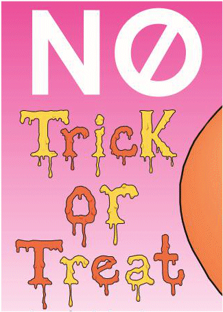

5 October 2017

Neighbourhood Watch Update

Thanks to PCSO Pauline Cimen for sending us the following update :

| Theft - Foots Cray Refuse/Recycling Centre - 29.09-01.10.2017 - 1350 hrs - Items taken - TV's and car batteries                                                                                                                                                                                                                                                                                                                                                                                                                                                                                                                  |
| :------------------------------------------------------------------------------------------------------------------------------------------------------------------------------------------------------------------------------------------------------------------------------------------------------------------------------------------------------------------------------------------------------------------------------------------------------------------------------------------------------------------------------------------------------------------------------------------------------------------------------- |
| Autumn nights are now drawing in. If you do go out early afternoon / evening and will be returning later that evening it may be worth leaving a lamp or light on for extra security. Please double check all doors and windows are properly locked and any alarms you may have are set. If you do have an alarm that is not working please get this checked and fixed as soon as you can. You may be thinking I will do it next week and so on. This is a great security device for you home and does make a difference so please make sure all alarms are functioning properly and let them do the job they are supposed to do. |
| One of the main culprits causing ASB on off road bikes in and around Foots Cray Meadows has been identified and will today be reported for 4 offences and hopefully we will be seizing the bike. This will hopefully reduce ASB on the Foots Cray Meadows. Please carry on reporting these bikes on the Meadows and any descriptions of the bikes etc would be most helpful. If you can safely take any pictures and send them to the Team that would be of great help as we have identified people by viewing these pictures. Only take pictures if you feel safe to do so and do not put yourself at any risk.                 |
| The team are also looking to recruit new Neighbourhood Watch Co-ordinators. Please contact the team if you are interested. We are happy to talk with anyone that would like to be a member. Please contact us on 07843291106 (please leave a message with your name and tel number if we are not available and we will contact you back) or Craymeadows.SNT@met.police.uk.                                                                                                                                                                                                                                                       |

---

Halloween is fast approaching. If you do not want Trick or Treat visitors, you can download the following poster to put in your window :

Click on the image above to download the full poster.

---

Thanks to Claire Tack, Neighbourhood Watch Office for the following message :

It is that time of year again when the Bexley Community Safety Partnership (BCSP) undertakes the Bexley Crime Survey. They are trying to reach as many people as possible. The BCSP includes the Local Authority, Police, Fire Brigade, Health, Probation and other organisations who work together to reduce problems of crime, anti-social behaviour and drug and alcohol misuse in Bexley. To help the Partnership decide its priorities for next year, the public are invited to say what crime and disorder issues cause them most concern in the area they live or work in, by completing the Big Bexley Crime Survey

[https://www.bexley.gov.uk/news/take-part-big-bexley-crime-survey](https://www.bexley.gov.uk/news/take-part-big-bexley-crime-survey)
