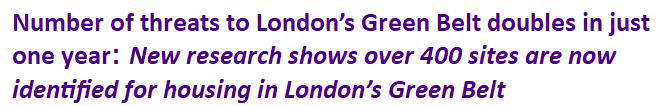

9 October 2017

Report on London's Green Belt

The number of sites under threat from development more than doubled between July 2016 and July 2017, from 203 to 443 and the number of houses proposed on the London Green Belt increased from 123,528 to 163,474.

The counties with the greatest number of threats are Hertfordshire (44,974 houses), Surrey (41,760) and Essex (35,674). The councils with the greatest number of threats are Central Bedfordshire (17,100), East Hertfordshire (16, 950) and Basildon (13,035)

You can read the full report by following this [LINK](http://www.northcrayresidents.org.uk/image/pdfs/lgbc_report_oct_2017.pdf)
