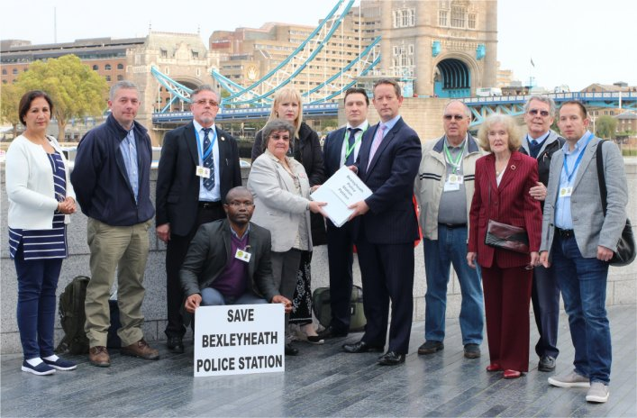

19 October 2017

Bexleyheath police station: Nearly 8,000 residents sign petition opposing London Mayor's closure plans

- Station will close under Sadiq Khan's wholesale cost-cutting proposals

- Concerned residents petition City Hall today

- Bexley's London Assembly member Gareth Bacon will present signatures to Mayor

A petition signed by nearly 8,000 residents opposing the closure of Bexleyheath police station was handed in to City Hall today.

Plans by London Mayor Sadiq Khan to close the front counter as part of wholesale savings across the force have been met with strong local opposition since they were announced.

The cost-cutting scheme involves closing Bexleyheath police station - which sits at the geographical centre of the borough - and moving services to an existing MPS facility in Sidcup.

Despite some short-term savings, additional funds will be needed for remodelling the alternative site to accommodate secure parking and front desk services.

It is feared the changes will move police away from higher crime areas in the northern part of the borough.

The petition which has received signatures both in person and online, has achieved in excess of 7,800 signatures, and is supported by a number of community groups including neighbourhood watch schemes, some of whom use the local police station as a base.

Conservative London Assembly Member Gareth Bacon, who today received the petition said:

This petition shows a growing concern from Bexley residents, particularly among elderly and vulnerable groups, about the Mayor's plans to close this vital community asset.

Residents are right to question the logic of moving police services away from the centre of the borough, further from the reach of many for reporting crime. It will also result in the loss of other community and crime prevention benefits that a permanent police presence brings.

We need to consider how this change will impact local communities in Bexley, as well as seeking assurances on how it will affect response times in the borough.

I fully support this petition and will be handing it to the Mayor.
