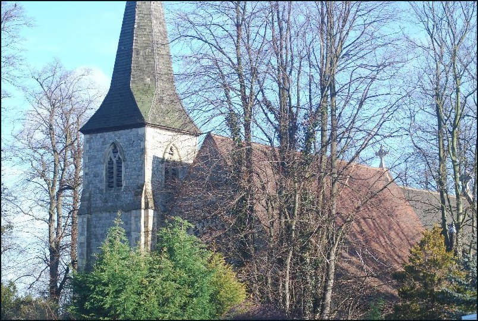

28 November 2017

Christmas 2017 at St James Church, North Cray

Thanks to Churchwarden Suzy Higgs for sending the following Timetable of Christmas events :

Sunday 3 December

3.00pm until 6.00pm Carolaire and Afternoon Tea

In the bothy with Guest Singer(s). Tickets £7.50 (numbers limited). Please contact Jenny Malster on 020 8302 4394.

Sunday 10 December

9.30am Family Christingle and Toy Service

This service celebrates the light of Christ with oranges, candles, ribbons and the fruits of the earth and a collection for the work of the Children's Society.

The service will incorporate our Toy Service, where many of us like to bring a toy which is then passed to the Children at Bexley Women's Aid who provides support and refuge to women and children experiencing domestic abuse. The service will be followed by "The Grand Christmas Draw".

Sunday 17 December

4.00pm Carol Service

A Service of readings and Carols as we prepare to celebrate Christmas

Sunday 24 December - Christmas Eve

9.30am Holy Communion Service with Carols

5.30pm Crib and Nativity Service

This traditional and well-loved service for all ages has something for everyone as we re-create the story of the birth of Jesus, placing the Christ-child in the crib at the centre of our worship.

Midnight Communion Service 11.15pm at St Barnabas Church, Joydens Wood

We join the congregation at St Barnabas Church, Joydens Wood as we celebrate the First Communion of Christmas.

Monday 25 December - Christmas Day

10.00am Family Service with Carols at St James Church

A Joint Christmas Day Service at St James as we are joined with the congregation of St Barnabas.

These times may be altered. Please check our website for details.

[www.allsaintsandstjames.org.uk](http://www.allsaintsandstjames.org.uk/)

