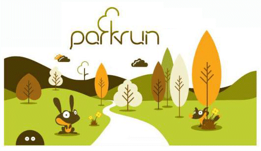

28 November 2017

Footscray Meadows - Parkrun

Thanks to Paul & Richard, Co-event directors, Bexley parkrun for sending the following message :

Bexley parkrun are looking to hold a weekly 5km walking/running event in the Meadows every Saturday morning.

To have an ongoing successful community event that is free and encourages exercise, socialising and welcomes people to enjoy the Meadows - we are reaching out to local residents to gauge opinion and support for this.

Click on the poster for full details

We are aim to collate any comments and concerns and address these in a clear and open forum towards the end of the year.
