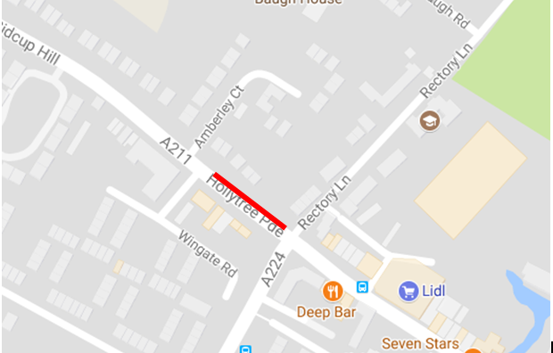

30 November 2017

Road Works - Sidcup Hill

Thanks to Councillor Don Massey for alerting us to following road works :

There is a gas leak on Sidcup Hill giving high readings of gas between Wingate Road and the traffic lights, on the Swanley bound carriageway.

There is a gang of gas operatives on site and there will 4 way traffic lights. Bus stops will remain closed until the work is complete.

The implementation of 4 way lights will require the removal of the filter lanes, and will lead to significant traffic disruption in the local area.

The expected duration of the works is unknown.

Any enquiries should be made direct to the contractor, SGN on 0800 111 999 as they will have the most up to date information.
