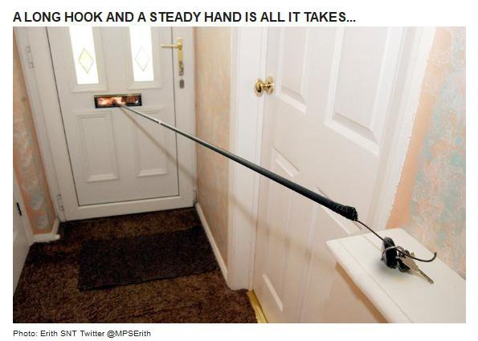

14 December 2017

Neighbourhood Watch Update

(1) Thanks to Andrew Davis from the Neighbourhood Watch Office for sending the following message :

Help protect against theft of your Christmas gifts, possessions and car this Christmas by making sure your keys are kept hidden away!

---

(2) Thanks to PC Paul Sealy from Police SNT Team for sending the following message:

Just a quick message to make you aware that there have been a group of males knocking on doors in the borough saying they are from Anglian Windows. There have been several reports and photographs posted on social media.

If you should get a knock on the door and it is one of these people, please close the door, call the police on 101 or try calling the Cray Meadows Team on 020 8721 2292.

We need to be able to stop these individuals and find out who they are.

There was a burglary on Sidcup Hill yesterday (Wednesday). The team were out on patrol at the time and attended what was a 'suspects on the premises' call but unfortunately they had left when we arrived.

Please be vigilant, challenge anything you get a feeling is not right.

---

(3) Thanks to PCSO Pauline Cimen from Police SNT Team for sending the following message :

PC Phil, PC Paul and myself will be in Tudor Café on Maidstone Road between 0930 - 130 hrs on Saturday 23rd December 2017. If anyone would like to come and meet the team please pop along. If you have any issues you would like to discuss with the team we would love to hear from you.

Wishing you all a very Merry Christmas and a prosperous New Year. Pauline.
