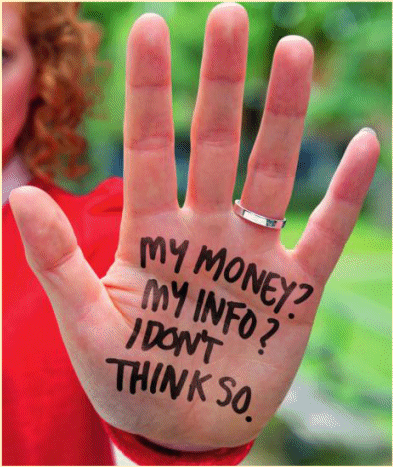

25 January 2018

Take Five To Stop Fraud Week

Thanks to Neighbourhood Watch & Action Fraud Alert for the followingl advice :

Click on the poster for an enlarged view

Take Five To Stop Fraud Week is part of the national campaign from Financial Fraud Action UK and the Government, backed by the banking industry coming together to tackle fraud.

The advice being issued this week is really simple but it can stop you becoming a victim of fraud.

(1) A genuine bank or organisation will never contact you out of the blue to ask for your PIN, full password or to move money to another account. Only give out your personal or financial details to use a service that you have given your consent to, that you trust and that you are expecting to be contacted by.

(2) Don't be tricked into giving a fraudster access to your personal or financial details. Never automatically click on a link in an unexpected email or text.

(3) Always question uninvited approaches in case it's a scam. Instead, contact the company directly using a known email or phone number.
