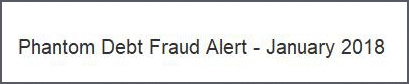

31 January 2018

Phantom Debt Fraud Alert

Thanks to Neighbourhood Alert for sending the following alert from Action Fraud :

Action Fraud has recently experienced an increase in the number of calls to members of the public by fraudsters requesting payments for a 'phantom' debt.

Click on the poster to read the full alert.
