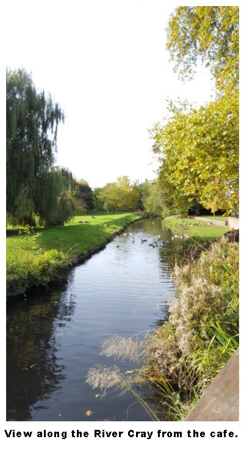

15 February 2018

PLACES TO VISIT - Part 2 - Hall Place

Open all year round, with extensive grounds through which the River Cray runs, Hall Place has much to offer including regularly changing exhibitions held in Hall Place itself.

The surrounding grounds has a Plant Shop, a riverside cafe, and there is a Farmers' Market On the first Sunday of each month between 10am and 2pm.

Forthcoming events include a River Cray Nature Walk on 17 March and a Mother's Day Afternoon Tea on 22 March.

For more information about Hall Place, and its current exhibitions etc, visit the

[Hall Place Web Site](http://www.hallplace.org.uk/).
