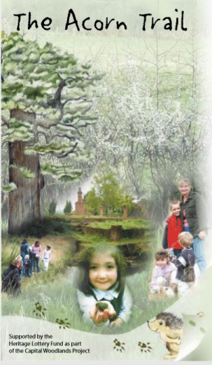

21 February 2018

PLACES TO VISIT Part 3 Scadbury Park

Scadbury Park Nature Reserve lies on the eastern edge of Chislehurst, overlooking the valley of the River Cray. With over 300 acres of beautiful countryside to explore, it forms part of a wildlife corridor linking to open countryside from Jubilee Country Park through Petts Wood and Scadbury, along the London Loop.

The Park has been managed as a country estate for many centuries and was once the home of the Walsingham family, which had links with North Cray; and later the Townshends of Frognal.

One of the Walks at Scadbury is the Acorn Nature Trail, about 2.5 miles long, which starts at the Old Perry Street Car Park. You can download a detailed leaflet from the very informative [Scadbury Park website](http://www.scadbury-park.org.uk/)or by following this[Link](http://www.northcrayresidents.org.uk/posters/poster132.pdf)
