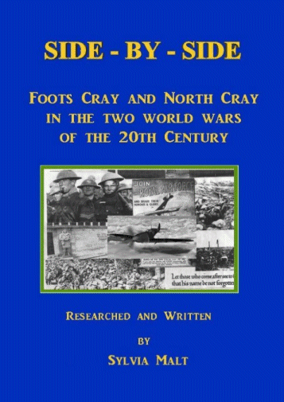

23 February 2018

NORTH CRAY PEOPLE - Part 3 - The two World Wars

Click on the cover

to open the book.

Many members will have read Side by Side, the remarkable history of those men of North Cray and Footscray who bravely gave their lives in World War One, written by Sylvia Malt and which Sylvia kindly allowed us to put onto the NCRA website.

It is with great pleasure that we can thank Sylvia again for allowing us to now publish the second completely revised version of Side by Side that encompasses both World Wars.

You can access the book from the Local History Page of the NCRA web site, or by clicking on the adjacent image of the book cover. Your computer will need 'Adobe Flash' for this to work.
