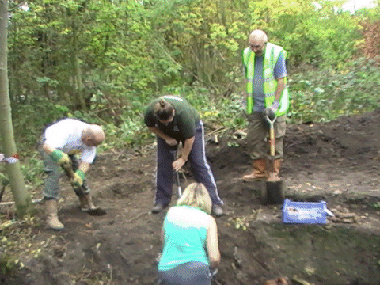

27 February 2018

LOCAL SOCIETIES & ORGANISATIONS - Part 2 - Bexley Archaeological Group

B.A.G. was first set up in 1979 by a small group of dedicated students, and it is still run by a dedicated team that has Archaeology, History and the wider community at its heart. It is an all-inclusive group that welcomes people of all ages and abilities. It also runs a Young Archaeological Club for children aged 8-16.

Click on the photograph

to enlarge.

B.A.G. offers people the chance to take part in excavations, geophysics, finds processing and other activities - mostly at weekends. It has its own dig (currently here in North Cray), which is open to members at weekends, weather permitting. It also has monthly talks and runs workshops during the year.

Membership is currently £14 for Individual Membership, £17 for a couple and £19 for a family living at the same address.

To find out more about B.A.G. and what it does visit the [www.bag.org.uk](http://www.bag.org.uk/) web-site.
