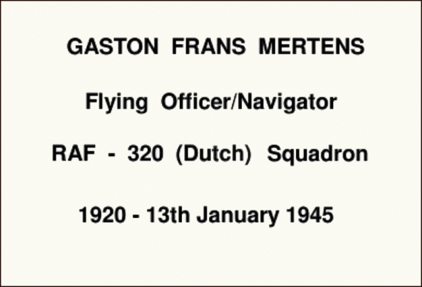

28 February 2018

NORTH CRAY PEOPLE - Part 4 - Gaston Mertens

A little over a week ago I was approached by a lady doing research on behalf of a relative in Belgium into a flying officer who was killed in WWII and who is remembered on the North Cray War Memorial.

Her family had lived in Parsonage Lane during the war, initially at Wychwood and then later at Manor Cottages.

During the discussion a very human story emerged which local historian Sylvia Malt has documented here :

If you stop to look at the poignant names engraved on the St. James' War Memorial Cross for WWII, you might be surprised to find a Belgian airman's name - Gaston Frans Mertens.

Click on the image

to read the full story.

Gaston came to know North Cray following his friendship with Harry Brunt's daughter, Norah. The Brunts at the time were living at a detached house called "Wychwood", Parsonage Lane.

Harry Brunt worked for the Co-Op, who were contracted by the Government to try to ensure sufficient food for the civilian population of south east London. His daughter, Norah, a schoolteacher at a Grammar school, wanted to improve her French and persuaded her mother to befriend a young Belgian escapee who had by way of France and Spain eventually made his way to England in order to enrol with the British Forces...... [Continue Reading](http://www.northcrayresidents.org.uk/posters/poster138.pdf)
