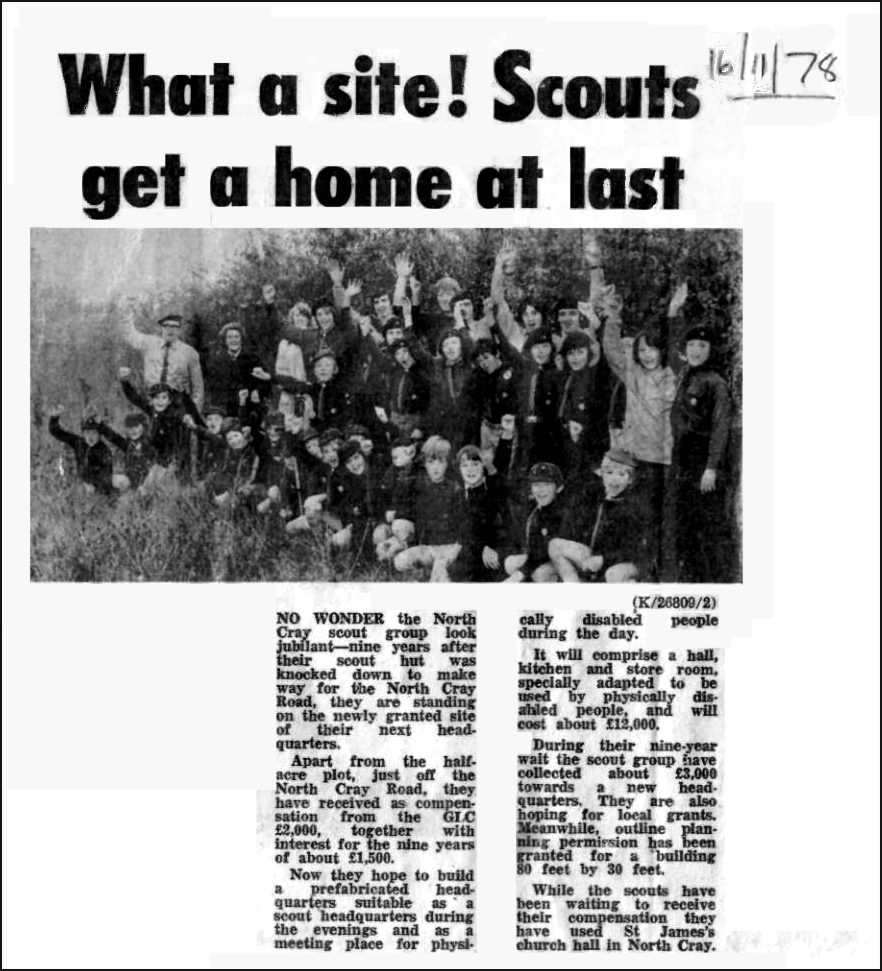
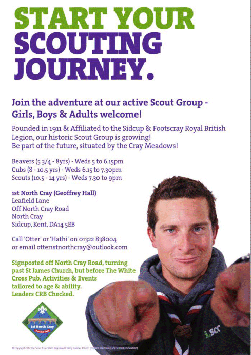

5 March 2018

LOCAL SOCIETIES & ORGANISATIONS - Part 3 - 1st North Cray Scouts

The 1st North Cray Scout Group has a great history and the Group has been saved from closure by dedicated Leaders who offer as much opportunity as possible to Beavers, Cubs and Scouts. They are an active Scout Group looking for members to join in with their adventures, challenges, badge earning, fun and friendship.

The 1st North Cray Scout Group are based right next to Footscray Meadows in Geoffrey Hall, the scout hall named after [Geoffrey Vesey Holt](http://www.northcrayresidents.org.uk/newsmail_files/nm0412.html) who in 1911 formed the the first Boy Scout Patrol of the district in North Cray and was Assistant Scout Master.

The hall was demolished in the mid 1960s to make room for the North Cray Road, then rebuilt after 9 years, during which time the Scouts used St James Church Hall.

Click on the photo to enlarge.

Their Leaders were nominated for Bexley Volunteer Awards and their Group Scout Leader has been awarded a Commissioners Commendation.

Click on the poster

for more details.

They are keen for more Young People to join, and as a Youth-Led Movement, they provide so much opportunity based on what their members want to do. They provide the challenges, skill developing and confidence boosting, but friendships are also huge benefits of Scouting. They guarantee a warm welcome and much Scouting enjoyment at every meeting.

Currently all Sections meet on a Wednesday from 5-9pm and they welcome all Young People irrespective of their ability or gender.

Beavers (6-8 years) - 5.00 to 6.15pm

Cubs (8-10.5 years) - 6.15 to 7.30pm

Scouts (10.5-14 years) - 7.30 to 9pm

If you have been thinking of a rewarding volunteer opportunity, please consider The 1st North Cray Scout Group. You might not want to go into Uniform, but there are plenty of other roles as well as that which they need to fill.
