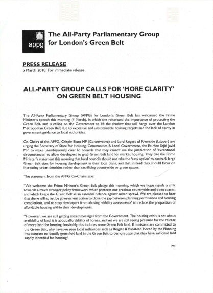

11 March 2018

NEWS FROM THE SECRETARY - Update on Green Belt matters and local Enforcement issues

Click on the poster

for more details.

Last week, our new Treasurer, Chris Moon, and I attended a meeting of the London Green Belt Council (LGBC). One of the items reported was the recent press release of The All-Party Parliamentary Group for London's Green Belt. This welcomed the Prime Minister's speech in which she had reiterated the importance of protecting the Green Belt but called on the Government to lift the shadow that still hangs over it due to excessive and unsustainable housing targets and the lack of clarity in government guidance to local authorities. It is urging the Secretary of State for Housing, Communities & Local Government to make unambiguously clear to councils that they cannot use the justification of 'exceptional circumstances' to allow developers to grab Green Belt land for market housing.

The meeting was also informed that the government had just published its proposals for its new National Planning Policy Framework (ie guidance to planning officers) to replace the current version dating from 2012. Its section on proposals affecting the Green Belt include statements such as "Inappropriate development is, by definition, harmful to the Green Belt and should not be approved except in very special circumstances" and that, when considering any planning application, local planning authorities should ensure that substantial weight is given to any harm to the Green Belt. It stresses that 'Very special circumstances' will not exist unless the potential harm to the Green Belt by reason of inappropriateness, and any other harm resulting from the proposal, is clearly outweighed by other considerations. It goes on to say that a local planning authority should regard the construction of new buildings as inappropriate in the Green Belt; but that exceptions include buildings for agriculture and forestry; the extension or alteration of a building provided that it does not result in disproportionate additions over and above the size of the original building; the replacement of a building, provided the new building is in the same use and not materially larger than the one it replaces; and limited infilling or the partial or complete redevelopment of previously developed land [brownfield], whether redundant or in continuing use which would not have a greater impact on the openness of the Green Belt than the existing development, or where the development would re-use previously developed land and contribute to meeting an identified local affordable housing need, and not cause substantial harm to the openness of the Green Belt. It adds the re-use of buildings provided that the buildings are of permanent and substantial construction. All this demonstrates how wrong it would be if Bexley were to (again!) grant planning permission for the current planning application for a housing estate at 139 North Cray Road.

A guest speaker also gave a presentation on the importance of the Green Belt for people's health and mental well-being, stressing that there was a huge cost to London (£26b) resulting from mental health problems, and that the size of the problem was more than cancer and heart disease. She pointed out that Londoners had the UK's highest anxiety level, and that the problem was growing. However, it was known that people's immune system and mental health increased when viewing nature, and when visiting forests and green spaces. To support this advice, we will be producing NewsMails on local walks in our Green Belt; and the LGBC will be working hard to further its Vision by means of a strategy group that will include bodies such as The Woodland Trust whose aim will be to improve people's quality of life, seek easy and quick access to the countryside, press for scenic landscapes, clean air and greater opportunities for recreation and sport - all aimed at promoting a healthier lifestyle.

Enforcement issues. Several continue to be unresolved due to the pressures on Bexley's very small Enforcement team. These include the illegal blocking of Public Footpath 137 (Parsonage Lane), and the unauthorised car sales business being carried out at No. 139 North Cray Road and the use of its land for the storage of cars on behalf of Toyota.

Jean Gammons

Secretary.
