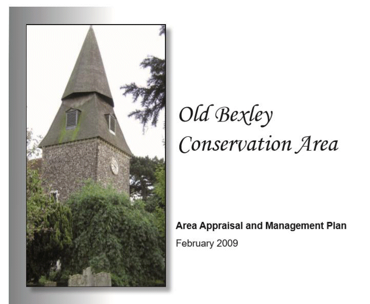

15 March 2018

LOCAL CONSERVATION AREAS - Part 4 - Old Bexley

The Old Bexley Conservation Area was designated in 1971, its area extended in 1987 and it was formally approved in 2010.

Its designation is justified by features that include the Village's historic street pattern and layout; its setting on the edge of the Metropolitan Green Belt; the semi-rural atmosphere around St Marys Church and the Manor House, and the landmark quality of St John's Church; the architectural quality and historic interest of the area's buildings, 18 of which are listed; a diverse range of building types, typical of their period; the prevalent use of local building materials, especially brick; and the picturesque area of the River Cray and the old ford.

Old Bexley lies at the juncture of two ancient tracks beside a ford on the River Cray. One route ran east/west between Eltham and Dartford, and the other followed the river north/south from Crayford to Orpington. Both were well established in the Middle Ages, crossing the River Cray where today's bridge now stands. Construction of the railway line, opened in 1866, cut the Village in two but had little impact on the street pattern.

The earliest written record of settlement in Bexley (Byxlea) was in a charter of 814; and it is referred to as Bix' in the Domesday Book, by which time time it had a church and three mills. Remains of medieval buildings suggest that the general settlement pattern has remained relatively unaltered.

To download Bexley's complete Area

Appraisal and Management Plan for the

Old Bexley Conservation Area

click on the poster above.

Some particularly old buildings remain, including St Mary's Church (which dates from the end of the 12th century). Behind this is the well-concealed 16th century Manor House, built on the site of an earlier house. Fronting the High Street are a number of other old buildings, including the Kings Head public house (16th/17th century); Bexley's former Poor House, or Work House at Nos. 34-36 High Street (1787) and No. 79 which is probably medieval timber-framed.

With the increased pattern of commuting and the electrification of the railway in 1926 came a boom of surburban house-building, and Bexley Village marks the edge of the spread of suburbia.

Old Bexley will combine with North Cray in May 2018 to become the new St Marys and St James ward. This is very appropriate because of their shared history.
