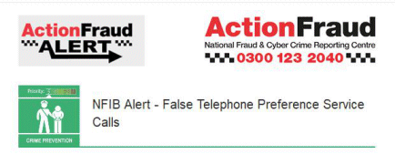

16 March 2018

False Telephone Preference Service Calls

Thanks to Neighbourhood Alert for sending the following Action Fraud alert :

Click on the poster

for more details.

Fraudsters are cold-calling victims, falsely stating that they are calling from one of the well-known UK telecommunication service providers. They call victims claiming to provide a 'Telephone Preference Service' - an enhanced call-barring service, which includes barring international call centres.
