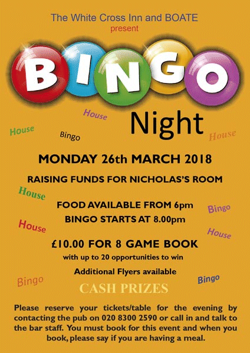

19 March 2018

(1) Bingo Night at the White Cross

Click on the poster

for larger view.

A quick reminder that BOATE had to cancel their last Bingo Night at the White Cross but happily have rescheduled the evening for Monday 26th March.

They hope that you can come along for a fun evening.

Please book with the pub directly either by phone on 020 8300 2590 or call in and talk to the bar staff. Please note, you must book for this event so that they know how many are coming.

When you book please tell them if you are having a meal.

---

(2) Two more Scams to be aware of

Thanks again to Dana Wiffen, Chairman, Neighbourhood Watch Office, for the following alerts :

ANOTHER PRE-RECORDED SCAM

Our Coordinator from Beechway has telephoned us to say she received a pre-recorded telephone call from someone claiming to be from Talk Talk, telling her that her IP-Address was corrupted and that if she called a given number giving details she would receive a free router. This is a scam, please ignore.

BE WARNED ROOFING & GUTTERING REPAIRERS IN YOUR AREA

A resident of Danson Crescent has brought to our attention two small homemade leaflets advertising roofing & guttering repair, claiming to be working in your area the wording is identical. We suggest you don't accept any work from door to door people even if they point out you have damaged guttering or roof. Always use a respectable and locally used company.
