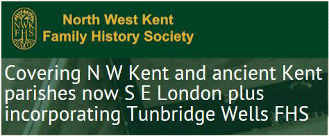

20 March 2018

LOCAL SOCIETIES & ORGANISATIONS - Part 4 North West Kent Family History Society

The North West Kent Family History Society was formed in 1978 with the object of aiding and encouraging the study of family history and genealogy in South East London and North West Kent.

Click on the image to

visit the web-site.

Membership offers a quarterly journal; meetings with talks at each of its three venues (Bromley, Dartford and Sevenoaks) and a Library.

Membership costs £10 for an Individual member and £12 for a Family.

The Society's Library, open to members every Wednesday and where workshops are held on a regular basis, is located in Summerhouse Drive, Joydens Wood Estate, Bexley DA5 2EE.

Click on the image to read their blog

full of news and other information.
