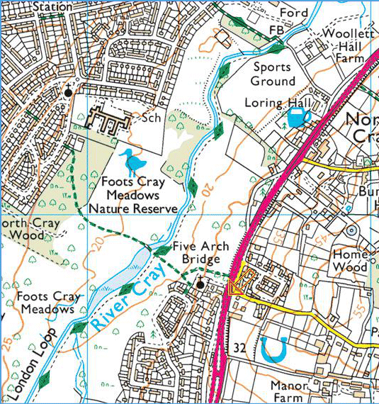

25 March 2018

Bexley RSPB walk - Foots Cray Meadows

Thanks to Bexley Wildlife for sending the RSPB walk report covering Foots Cray Meadows, Upper College Farm & Five Arches that took place on Tuesday 20th March 2018.

Click on the map (left) to read the full report.

Alternatively you can visit the excellent [Bexley Wildlife](http://www.bexleywildlife.org/) web-site where you will see this and many other fascinating articles and wildlife campaigns.

You will also find an opportunity to subscribe to their blog and receive regular local wildlife articles direct to your inbox.
