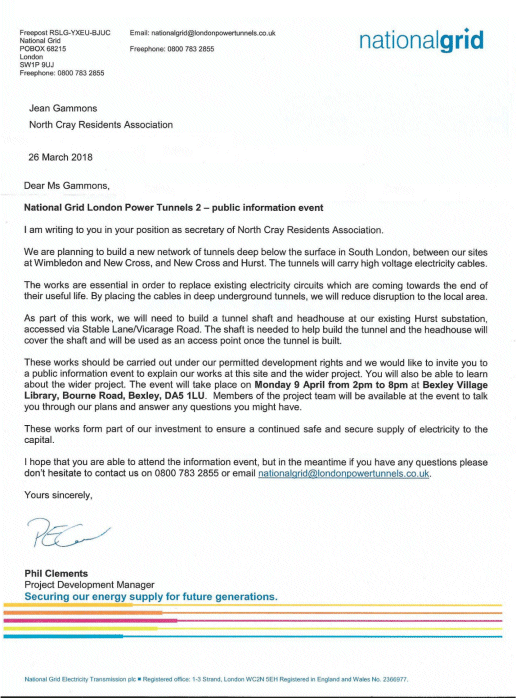

28 March 2018

NATIONAL GRID

The National Grid is planning to build a new network of deep tunnels to carry high voltage electricity cables.

As part of this work, it needs to build a tunnel shaft and headhouse at its existing Hurst substation, accessed via Stable Lane/Vicarage Road.

An invitation has been given to us to attend a public information event in Bexley Village, where members of the project team will be available to talk through the plans and answer any questions: Monday 9 April from 2pm to 8pm at the Bexley Village Library, Bourne Road.

Click on the letter above left for more details
