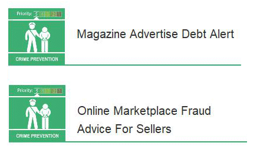

6 April 2018

Fraud Alerts

Thanks to Neighbourhood Alert for the following two fraud warnings :

(1) Victims receive a telephone call from someone purporting to be a bailiff enforcing a court judgement, attempting to recover funds for a non-existent debt. The fraudsters state the debt originates from the victim not paying a magazine advertisement subscription.

(2) Action Fraud has received several reports indicating that sellers of items on online marketplace websites are falling victim to fraud by bogus buyers. Typically, the bogus buyers contact the seller wanting to purchase the item for sale and advise they will be sending the requested amount via PayPal or other electronic payment method.

Click on the poster above, left for more details of the methods used by these fraudsters.
