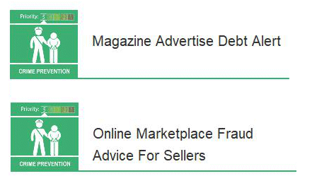

14 April 2018

Fraud Alerts from Neighbourhood Alert

Thanks to Neighbourhood Alert for the following advice notice :

Fraudulent websites alleging to offer cryptocurrency investments are dishonestly using the image of Martin Lewis, the founder and editor for moneysavingexpert.com, as an endorsement for their companies.

Click on the poster

to read the full alert.

The adverts using Martin Lewis to promote illicit schemes can be found on social media and other websites. Clicking on the advert takes you to the full article where Martin Lewis's image is presented along with fake quotes recommending investments in bitcoin and other digital currencies with the fraudulent 'company'. Alternatively clicking on the advert will take you to a page where you are required to input your contact details, the suspect company then phones you and encourages you to invest.
