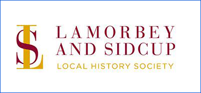

15 April 2018

LOCAL SOCIETIES & ORGANISATIONS - Part 6 Lamborbey & Sidcup Local History Society

Click on the poster

for further information.

The Lamorbey & Sidcup Local History Society was formed in 1952 as an off-shoot from a local history class that once met at the Lamorbey Park Adult Education Centre. Initially it was called the Local History Group, but was renamed "Society" in 1956.

Its geographical area of interest is the southern region of the London Borough of Bexley in north west Kent, comprising Sidcup, Blackfen, Foots Cray and North Cray. Its interest in local history extends beyond the boundaries of Sidcup into Kent, London and the surrounding areas. This is reflected in the variety of its meetings.

The Society meets monthly from January to December, with the exception of August, at St Lawrence's Church Hall, Main Road, Sidcup. Its President is Malcolm Barr-Hamilton, who is one of the team of Volunteers who give such valuable support to the North Cray Residents Association.
