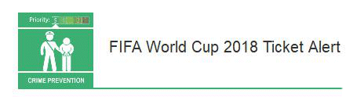

21 April 2018

Fraud Alert from Neighbourhood Alert

Thanks to Neighbourhood Alert for the following 2018 FIFA World Cup advice notice :

The 2018 FIFA World Cup will take place from 14th June - 15th July 2018. The worldwide demand for match tickets is expected to be significant.

Click on the poster

to read the full alert.

Action Fraud have been alerted to several websites which are offering World Cup Tickets for sale, some at highly inflated prices. A FIFA spokesperson said:

FIFA regards the illicit sale and distribution of tickets as a very serious issue and it has been reminding all football fans that FIFA.com/tickets is the only official and legitimate website on which to buy 2018 FIFA World Cup tickets.
