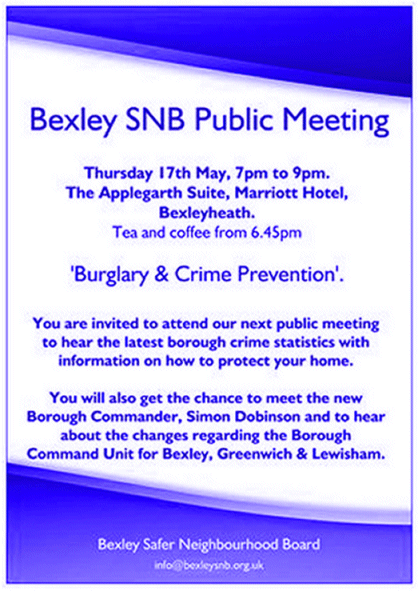
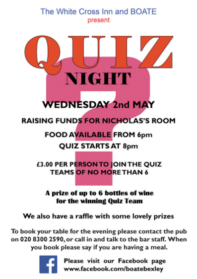

23 April 2018

(1) BexleySNB Public Meeting

Thanks to Danielle Fuller, Co-ordinator and Chair, Joyce Sutherland for the following invitation :

Dear Resident You are invited to the BexleySNB public Meeting on Thursday 17th May.

Click on the poster

for an enlarged view.

The main topic will cover Burglary and Crime Prevention, and Neighbourhood Watch will be there as well to provide information.

You will also be able to hear about the new Borough Command Unit (BCU) that affects Bexley, Greenwich and Lewisham and meet the Borough Commander, Simon Dobinson.

Refreshments will be served from 6.45pm and we look forward to seeing you there.

---

(2) Quiz Night at the White Cross - 2nd May

Thanks to Jean Gammons for passing on the following invitation from Steve Brown to attend BOATE's next Quiz Night :

If you attended our April Quiz night, thanks very much for your support.

Click on the poster

for an enlarged view.

We are now looking forward to our next Quiz Night on 2nd May at the White Cross as usual starting at 8.00pm.

If you are interested in joining us for what will be a fun evening, please book with the pub directly either by phone on 020 8300 2590 or call in and talk to the bar staff.

When you book please don’t forget to tell them if you are having a meal.

I look forward to welcoming you.

Kind Regards

Steve Brown

Marketing
