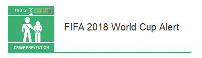
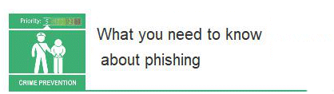

27 April 2018

Fraud Alerts

Thanks to Neighbourhoodalert for sending the two following alerts :

(1) FIFA 2018 World Cup Alert - Update

The 2018 FIFA World Cup will take place from 14th June – 15th July 2018.

Click on the poster

for an enlarged view.

The worldwide demand for match tickets, flight tickets, and somewhere to stay throughout the competition is expected to be significant. Those planning to travel should exercise caution when considering the purchase of tickets or accommodation because the event is highly likely to be targeted by fraudsters looking to take advantage of unsuspecting fans.

---

(2) What you need to know about phishing

What is phishing? Fraudulently sending emails purporting to be from reputable companies in order to trick individuals into revealing personal information, such as passwords and financial information. Phishing can also be carried out over text messages (smishing) and phone calls (vishing).

Click on the poster

for an enlarged view.

Links

Don't click on the links in unsolicited emails and texts.

Attachments

Don't open the attachments in unsolicited emails.

Your information

Don't reveal personal or financial information as a result of unsolicited emails, texts or calls.
