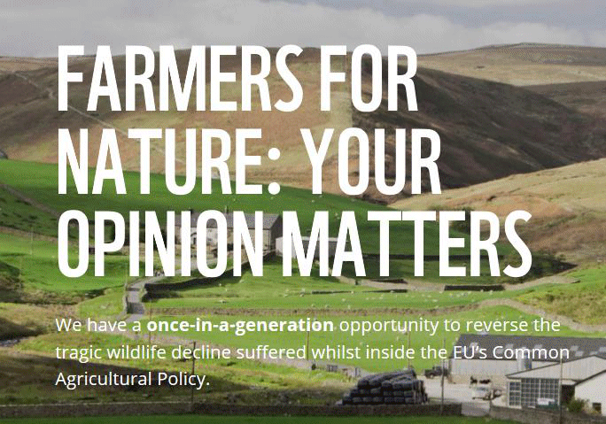

28 April 2018

Reverse Our Tragic Wildlife Decline

Thanks to World Wildlife Foundation for sending the following message :

We need you to demonstrate

your support for this proposal

before Tuesday 8 May 2018.

Click on the poster

for more details.

The UK Government is proposing an exciting and radical new agricultural policy that could help bring back butterflies, birds and bees to the English countryside and help us begin restoring our natural world.

STAND UP FOR NATURE IN ENGLAND

If this new agricultural policy becomes legislation, farmers would be supported to bring back natural environments for English wildlife to thrive in.

Through this policy, English farmers would be financially supported to protect environmental elements that don't bring in direct income, such as: creating new habitats for wildlife, improving air quality, reducing flood risk, improving public access and better animal welfare standards.
